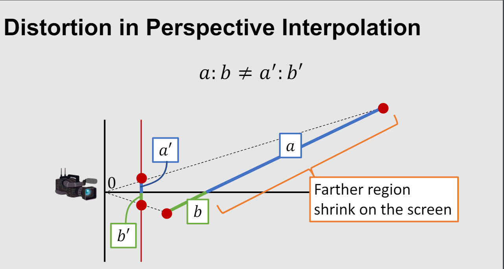
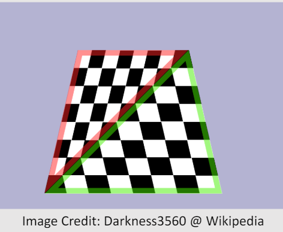
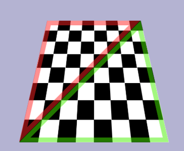

<head>
    
    
</head>

# 从screen pixels 到 barycentric coordinates

## 2024-5-10

## 扭曲的重心

在光栅化阶段的时候，需要对片元进行插值，这时候需要用到三角形的重心坐标(barycentric coordinates)。

在这个阶段，重心坐标的计算有几种方式。

第一种可以直接用片元在屏幕上的投影坐标来直接计算，通过计算每个顶点相对的三角形的面积的比例来得到：

$$
	\vec{b}  = (area1,area2,area3)/(area1+area2+area3)
$$

但是这种在方式会导致distortion，因为投影到屏幕上的三角形的比例相比较相机空间的三角形已经发生了变化。
如下图:

直接这样得到的重心坐标如果用来插值的话，会得到错误的结果:

其实使用三角形的面积比例来求重心坐标的式子相当于就是用每两条边的叉乘的结果来做比，而叉乘结果又是normal向量，
normal向量在缩放之后与三角形的相对位置关系会错误，所以也就不能这么算，
可以参考这篇：[normal transform](https://waizui.github.io/normalTransform/normalTransform.html)。

## 换一个空间中计算

那么如何才能得到正确的结果?

首先就是将所有计算都放到相机空间中去计算，而不是通过屏幕投影。

但是这里引出来一个问题，光栅化的时候是从片元的屏幕坐标开始计算，也就是片元对应的三角形上的点的深度坐标是不知道的。
这要如何处理?

一种理论上可行的方式是用raycast去找三角形上那个点，但是这样效率很低，而且数值也不稳定。

还有一种方式是通过找到几个约束，构建一个非齐次线性方程组，然后用矩阵运算来求解。这种方式可以用硬件实现而且数值稳定。

已知三角形三个顶点在相机空间中的齐次坐标为

$$
	\vec{q0} = (q0_x,q0_y,q0_z,q0_w)
    \\
	\vec{q1} = (q1_x,q1_y,q1_z,q1_w)
    \\
	\vec{q2} = (q2_x,q2_y,q2_z,q2_w)
$$

首先假设片元的屏幕坐标为 $\vec{s}=(s_x,s_y)$，那它的齐次坐标就是 $\vec{s}=(s_x,s_y,0,1)$，
对应的三角形上的点在相机空间的坐标就可以设为 $\vec{s_v}=(s_x*w,s_y*w,z,w)$，其中w,z为未知数。
同时再设该点的重心坐标为 $\vec{b}=(b_0,b_1,b_2)$ 。

通过重心坐标的定义可以得到三个方程:

$$
	 q0_x*b_0+q1_x*b_1+q2_x*b_2 = s_x*w
     \\
	 q0_y*b_0+q1_y*b_1+q2_y*b_2 = s_y*w
     \\
     b_0+b_1+b_2 = 1
$$

按照熟悉的感觉来看的话，下一个方程再找一个关于z的就行了，可是关于z的方程并不好找，那该怎么办？
其实tricky的地方在于不需要管未知数z，只需要再找一个关于w的方程就可以解出所有需要的量了。
关于w的方程是容易找到的。

注意到三个顶点的w变量，他们与$\vec{s_v}$的w变量也满足重心坐标的性质(在四维的齐次空间)。
也就可以得到：

$$
	 q0_w*b_0+q1_w*b_1+q2_w*b_2 = w
$$

这时候方程个数已经够了，通过移项构建等式

$$
    \begin{bmatrix}
    q0_x & q1_x & q2_x & -s_x   \\
    q0_y & q1_y & q2_y & -s_y   \\
    1    & 1    & 1    & 0      \\
    q0_w & q1_w & q2_w & -1     \\
    \end{bmatrix}

    \begin{bmatrix}
    b_0 \\ 
    b_1 \\
    b_2 \\
    w \\
    \end{bmatrix}
    = 

    \begin{bmatrix}
    0 \\ 
    0 \\
    1 \\
    0 \\
    \end{bmatrix}
$$

最左边的矩阵的逆通过调库容易求出，剩下就是左乘它直接求解 $\vec{b}$。

如果用这个结果来插值，就不会产生distortion。

## References:

[Appied Computer Graphics by Prof. Nobuyuki Umetani](https://github.com/ACG-2024S/acg)
