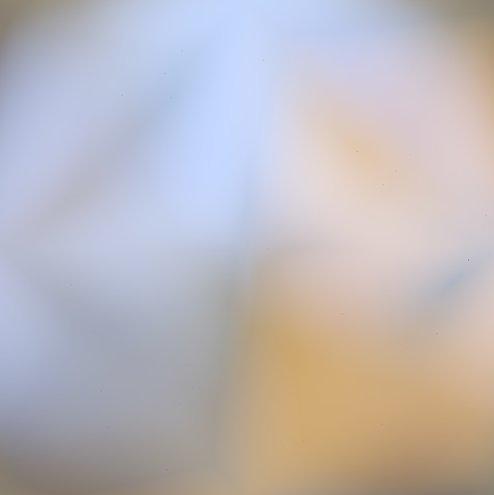
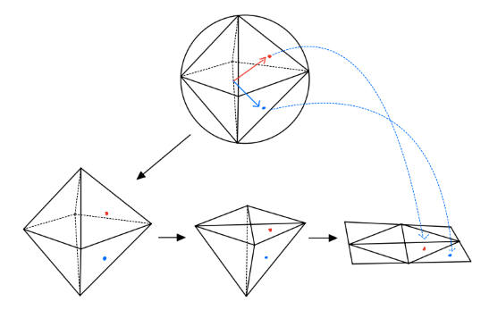
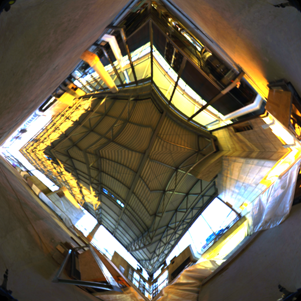
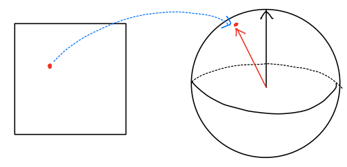
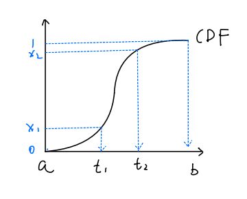
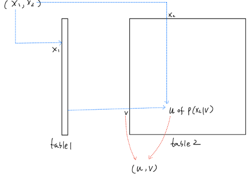
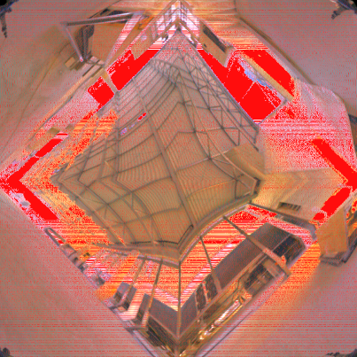
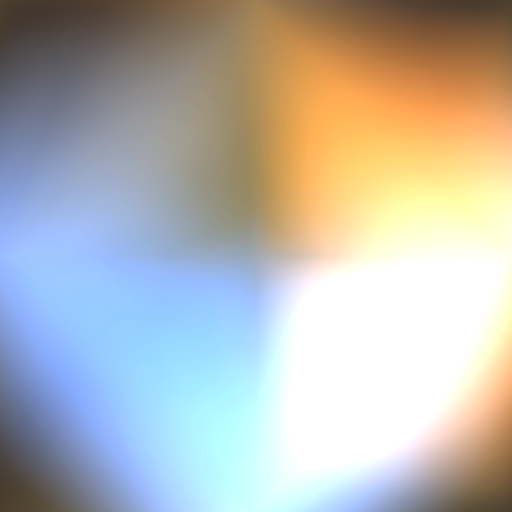

<head>
    
    
</head>

# Sampling Octahedron Environment Map Lighting

This article will explain how to get a beautiful environment lighting map.
The steps can be divided into: 

1. [Introduce octahedron environment map.](#octahedron-environment-map)
2. [Define a rendering equation.](#rendering-equation)
3. [A brief review of Monte Carlo.](#review-monte-carlo-method)
4. [Prepare for solving the rendering equation.](#solve-rendering-equation)
5. [Calculate a inverse CDF map.](#importance-sampling)
6. [Evaluating.](#evaluating)

The generated picture looks like this:

**Fig.1. Sampling positions(left) and Environment lighting(right)**

## Octahedron environment map

Octahedron environment map is a image that can be treated as unwrapping a sphere onto a octahedron 
then flatten the octahedron to a square.

**Fig.2. Sphere points to square points**

This image will be used for illustration in this article:

**Fig.3. The texture**

The details of mapping $(u,v) \in [0,1]^2$ onto unit sphere's surface can be found here:
[Octahedron Mapping](https://pbr-book.org/4ed/Geometry_and_Transformations/Spherical_Geometry#x3-Equal-AreaMapping)

## Rendering Equation

The rendering equation used here is:

$$
\begin{align}
    L_o(p,\omega_o) &= L_e(p,\omega_o)+\int_{H} f_r(p,\omega_o,\omega_i)L_i(p,\omega_i)(n \cdot \omega_i)d\omega_i  \\
\end{align}
$$

where $\omega_o,\omega_i$ is outgoing direction and negative incoming direction respectively. 
$L_o$ is outgoing radiance at position $p$, $L_e$ is emitted radiance, $L_i$ is incoming radiance,
$H$  is sphere, $f_r(p,\omega_o,\omega_i)$ is BRDF, $n$ is surface normal.

For reflection , emitted radiance always be zero, so it can be omitted. Only upper hemisphere is affecting,
thus the integral domain is upper hemisphere, Then the final rendering equation used is the form without emitted radiance term:

$$
\begin{align}
    L_o(p,\omega_o) &=  \int_{\Omega} f_r(p,\omega_o,\omega_i)L_i(p,\omega_i)(n \cdot \omega_i)d\omega_i  \\
\end{align}
$$

Notice that $\omega_i$ is **negative direction** of incoming direction.
Basically, the rendering equation defines what kind of operations we should do in order to get the outgoing radiance.
But, what operations exactly? The answer lies on solving the equation using Monte Carlo method.

## Review Monte Carlo method

I have briefly introduced [Monte Carlo method](https://waizui.github.io/posts/monte_carlo/monte_carlo.html) before, here are some supplementary explanation.

First, for a Monte Carlo estimator:

$$ F_n = \frac{1}{n} \sum_{i=1}^{n} \frac{f(x_i)}{p(x_i)} $$

The best pdf $p$ is 

$$p(x) = \frac{f(x)}{\int_a^bf(x)dx}$$

this makes variance minium.

Second, for solving rendering equation, we  use this Monte Carlo estimator:

$$
\begin{align}
    L_o(p,\omega_o) &=  \int_{\Omega} f_r(p,\omega_o,\omega_i)L_i(p,\omega_i)(n \cdot \omega_i)d\omega_i  \\
            & \approx \frac{1}{N} \sum_{j=0}^{N} \frac{f_r(p,\omega_o,\omega_j)L_i(p,\omega_j)(n \cdot \omega_j)}{pdf(\omega_j)} \\
\end{align}
$$

## Solve Rendering Equation
Since the discrete form of rendering equation is derived as:

$$
\begin{align}
    L_o(p,\omega_o) \approx \frac{1}{N} \sum_{j=0}^{N} \frac{f_r(p,\omega_o,\omega_j)L_i(p,\omega_j)(n \cdot \omega_j)}{pdf(\omega_j)} \\
\end{align}
$$

We can answer the question that what operations we should do?

- Basically, we choose a direction $\omega_j$.

- In that direction, we get the incoming radiance $L_i$ and BRDF, which is a constant value $ \rho/\pi $ and we choose $\rho =1$
in this article. 

- Next, we multiply BRDF and radiance then scale the result with the product of surface normal $n$ and direction vector $\omega_j$.

- Then, divide the result by probability density function $pdf$ in that direction, weight it by the inverse of sampling count $N$.

- Finally, sum all results.

The steps seems simple enough, we can easily calculate  $f_r(p,\omega_o,\omega_j)$ and $(n \cdot \omega_j)$. 
Incoming radiance can be fetched by looking up environment texture, the problems left is how to get $pdf$ value and 
how to determine which direction $\omega_j$ we should choose.

## Importance sampling

Let's start with how to determine which direction to choose. Ideally, we want the direction to only focus on the light sources.
Because if there are no light sources in one direction, it has no contribution to final result, we can skip the sampling of this direction. 
Doing so is called **Importance sampling**,
which makes  Monte Carlo estimator $ F_n = \frac{1}{n} \sum_{i=1}^{n} \frac{f(x_i)}{p(x_i)} $ converges more quickly.

And how to get those directions that follows the direction of light sources? 

In this article, we are using a octahedron environment map for lighting, a point $(u,v)\in[0,1]^2$ 
can be mapped onto the surface of a sphere.
So, for every pixel on the environment map represents incoming radiance of direction that from the sphere center point to corresponding surface position.

**Fig.4.**

The idea of doing importance sampling for environment map is to design a function that takes variable in $ [0,1]^2 $ and out put uv coordinates on the map
and those coordinates follow the distribution of our target pdf, which means they exist more in bright area and less in dark area.

With this idea, we can design the function as following:

First, we need to calculate pdf value of each pixel on environment map, since we only care about the luminance not the color of light,
we can convert environment map into grayscale image and calculate pdf using:

$$
\begin{align}
    pdf(u,v) &=\frac{g(u,v)}{A} \\
             &\approx \frac{g[x,y]}{A}
\end{align}
$$

where  $g$ is grayscale value at $(u,v)$, $g[x,y]$ refers indexing grayscale map using pixel coordinates $x,y$. 
$A$ is the integral over grayscale map, which can be calculated as:

$$
\begin{align}
    A  &= \int_0^1\int_0^1 g(u,v) du dv \\
       &\approx \frac{1}{HW} \sum_{y=0}^{H-1} \sum_{x=0}^{W-1}g[x,y]
\end{align}
$$

Where $H,W$ is height and width of grayscale map.

Then, in order to map two variables onto the grayscale map according to its luminance distribution, 
we can use **Inverse Cumulative distribution function**.

**Cumulative distribution function(CDF)** defined as:

$$
\begin{align}
    cdf(x) &= \int_a^x pdf(t)dt, x\in[a,b]
\end{align}
$$

CDF does not have many properties we want, but the inverse CDF can map variables in $[0,1]$ to $[a,b]$ according to the distribution of PDF.

$$
\begin{align}
    t &=  cdf^{-1}(x), x\in [0,1], t\in [a,b]
\end{align}
$$

This is illustrated in following fig:

**Fig.5. Majority of x are mapped into $[t_1,t_2]$ since random variable t has very high probability density within $[t_1,t_2]$.**

Even though inverse CDF has desired properties, we can not analytically get inverse CDF in most cases.
One solution is numerically calculate the inverse CDF and store results in some look-up tables.

To numerically calculate inverse CDF of two dimensional variables, we need to calculate **conditional probability distribution** at first:

$$
\begin{align}
    p(u|v) &= \frac{pdf(u,v)}{p_V(v)}  \\
\end{align}
$$

where $p_V(v)$ is **marginal distribution** of variable $v$, which can be calculated using:

$$
\begin{align}
    p_V(v) &= \int_0^1 pdf(u,v)du \\
           &= \int_0^1 \frac{g(u,v)}{A}du \\
           &\approx \frac{1}{A} \frac{1}{W} \sum_{x=0}^{W-1}g[x,y]
\end{align}
$$

So, conditional probability distribution can be calculated as:

$$
\begin{align}
    p(u|v) &= \frac{pdf(u,v)}{p_V(v)}  \\
           &\approx \frac{g[x,y]/A}{\frac{1}{A} \frac{1}{W} \sum_{x=0}^{W-1}g[x,y] } \\
           &=\frac{g[x,y]}{\frac{1}{W} \sum_{x=0}^{W-1}g[x,y] }
\end{align}
$$

Having conditional probability $p(u|v)$ and marginal probability $p_V(v)$, 
we can use $p_V(v)$ to calculate inverse CDF for $v$ and $p(u|v)$ for $u$ of $v\in[0,1]$ respectively.
then store results in two look-up tables. Later we can use uniform variables $(x_1,x_2)$
to get $(u,v)$ from those tables. This is illustrated in Following fig. 

**Fig.6. For example, storing inverse CDF values of marginal distribution in table1 and of conditional distribution in table2, 
then use table1 mapping variable x1 to v, and use variable x2 and v to get conditional distribution u from table2.**

A code example of Importance Sampling can be found [here](https://github.com/waizui/rs-sampler/blob/main/src/envmap.rs#L265).
The execution result of this code is the image of point's distribution using inverse CDF mapping as fig.7.

**Fig.7. Result of Importance Sampling(IS), sampling points(red dots) distributed more in bright area**

## Evaluating

Finally, after getting PDF values and choosing sampling directions, we can now continue calculating our Monte Carlo estimator of rendering equation.
I use an image represents a sphere, every pixel on this image can be mapped onto the sphere's surface,
then evaluating rendering equation at every pixel is equivalent evaluating at sphere's surface.

Meanwhile, the Monte Carlo estimator should be modified because I use uv coordinates instead of $\omega_i$:

$$
\begin{align}
    L_o(p,\omega_o) &\approx \frac{1}{N} \sum_{j=0}^{N} \frac{f_r(p,\omega_o,\omega_j)L_i(p,\omega_j)(n \cdot \omega_j)}{pdf(\omega_j)} \\
                    &= \frac{1}{N} \sum_{j=0}^{N} \frac{f_r(p,\omega_o,\omega_j)L_i(p,\omega_j)(n \cdot \omega_j)}{pdf(u_j,v_j)}|J| \\
\end{align}
$$

Where $J$ refers to **Jacobian** of parameterize $\omega_i$ using $(u,v)$ and the value is $4\pi$.

So the Rendering Equation can be expressed as:

$$
\begin{align}
     L_o(p,\omega_o) &\approx \frac{1}{N} \sum_{j=0}^{N} \frac{ \frac{1}{\pi} L_i(p,\omega_j)(n \cdot \omega_j)}{pdf(u_j,v_j)}4\pi \\
                     &=\frac{4}{N} \sum_{j=0}^{N} \frac{L_i(p,\omega_j)(n \cdot \omega_j)}{pdf(u_j,v_j)} \\
\end{align}
$$

Having this equation, we can implement it, A code(rust) example of rendering can be found [here](https://github.com/waizui/rs-sampler/blob/main/examples/envmap_example.rs#L10).

Following is the rendering result.

