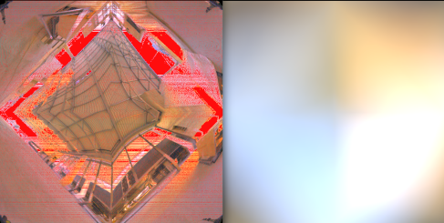

<head>
    
    
</head>

# Sampling Octahedron Environment Map Lighting

I will explain how to get a beautiful environment lighting map in this article.
The steps can be divided into: 

1. Define a rendering equation.
2. A brief review of Monte Carlo.
3. Prepare for solving the rendering equation.
4. Calculate a inverse CDF map.
5. Sampling.

The generated picture looks like this:

## Rendering Equation

The rendering equation used here is:

$$
\begin{align}
    L_o(p,\omega_o) &= L_e(p,\omega_o) + \int_{H} f_r(p,\omega_o,\omega_i)L_i(p,\omega_i)(n \cdot \omega_i)d\omega_i  \\
\end{align}
$$

where $\omega_o,\omega_i$ is outgoing direction and negative incoming direction respectively. 
$L_o$ is outgoing radiance at position $p$, $L_e$ is emitted radiance, $L_i$ is incoming radiance,
$H$  is sphere, $f_r(p,\omega_o,\omega_i)$ is BRDF, $n$ is surface normal.

For reflection , emitted radiance is always be zero, so it can be omitted, and only upper hemisphere is affecting,
thus the integral domain is upper hemisphere, Then the final rendering equation used is the form without emitted radiance term:

$$
\begin{align}
    L_o(p,\omega_o) &=  \int_{\Omega} f_r(p,\omega_o,\omega_i)L_i(p,\omega_i)(n \cdot \omega_i)d\omega_i  \\
\end{align}
$$

Notice what we want is the radiance of outgoing direction, and $\omega_i$ is negative direction of incoming direction.
Basically, the rendering equation defines what kind of operations we should do in order to get the outgoing radiance.
But, what operations exactly? The answer lies on solving the equation using Monte Carlo method.

## Review Monte Carlo method

I have briefly introduced [Monte Carlo method](https://waizui.github.io/posts/monte_carlo/monte_carlo.html) before, here are some supplementary explanation.

First, for a Monte Carlo Integral:

$$ F_n = \frac{1}{n} \sum_{i=1}^{n} \frac{f(x_i)}{p(x_i)} $$

The best pdf $p$ is 

$$p(x) = \frac{f(x)}{\int_a^bf(x)dx}$$

this makes variance minium.

Second, for solving rendering equation, we can use Monte Carlo method:

$$
\begin{align}
    L_o(p,\omega_o) &=  \int_{\Omega} f_r(p,\omega_o,\omega_i)L_i(p,\omega_i)(n \cdot \omega_i)d\omega_i  \\
            & \approx \frac{1}{N} \sum_{j=0}^{N} \frac{f_r(p,\omega_o,\omega_j)L_i(p,\omega_j)(n \cdot \omega_j)}{pdf(\omega_j)} \\
\end{align}
$$

## Solve Rendering Equation
Since the discrete form of rendering equation is derived as:

$$
\begin{align}
    L_o(p,\omega_o) \approx \frac{1}{N} \sum_{j=0}^{N} \frac{f_r(p,\omega_o,\omega_j)L_i(p,\omega_j)(n \cdot \omega_j)}{pdf(\omega_j)} \\
\end{align}
$$

We can answer the question  what operations we should do. 

- Basically, we choose a direction $\omega_j$.

- In that direction, we get the incoming radiance $L_i$ and BRDF, which is a constant value $ \rho/\pi $ and we choose $\rho =1$
in this article. 

- Next, we multiply BRDF and radiance then scale the result with the product of surface normal $n$ and direction vector $\omega_j$.

- Then divide the result by probability density function $pdf$ in that direction, weight it by the inverse of sampling count $N$.

- Finally, sum all results.

The steps seems simple enough, we can easily calculate  $f_r(p,\omega_o,\omega_j)$ and $(n \cdot \omega_j)$. 
Incoming radiance can be fetched by looking up environment texture, the problems left is how to get $pdf$ value and 
how to determine which direction $\omega_j$ we should choose.

## Importance sampling

Let's start with how to determine which direction to choose. Ideally, we want the direction to focus on the light sources,
If there are no light sources in one direction, we can skip the sampling of this direction, 
since it has no contribution to final result.

**to be continued...**
