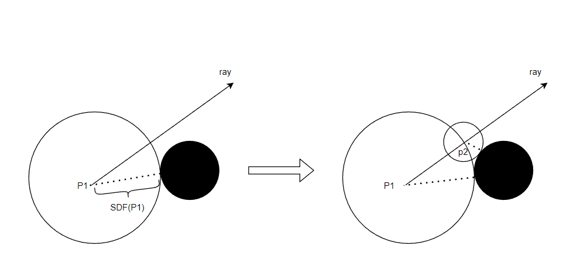
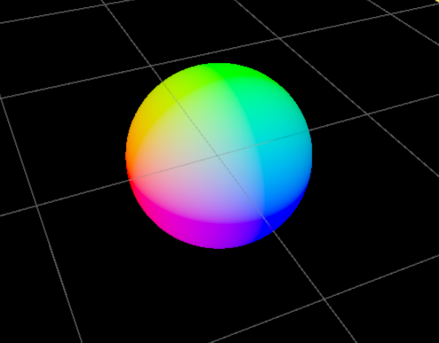

# Ray Marching


## 简介
在渲染中，ray marching是一种寻找相交信息的方法，通过沿着一条射线一步一步前进，在每一步中进行采样得到相交信息。
这种方法在做体积渲染时很有用，比如特效，还有云层等。因为这种方法总是一步一步的沿着一条射线前进，就像行军一样，
所以叫做marching.

## sphere tracing
其中一种ray marching的实现是球形追踪，现在我们假设要渲染一个最简单的场景，场景里只有一个球体，球心在原点，
半径为1。那么ray marching可以分为以下几步：  

1. 选择一个点作为射线的起点， 通常这个点是摄像机机的位置。  

2. 选择一个方向，作为射线发出的方向，通常这个方向指向我们要渲染的片元，比如下图中的红色射线。  
  

3. 现在，我们选定第一个要采样的点P1，也就是射线起点， 
然后通过一个符号距离函数SDF(Signed Distance Function)来采样，得到当前采样点到最近的表面的距离。
这个SDF函数根据要渲染的场景不同有不同的实现，在我们例子的场景里，只有一个圆球，所以SDF很简单,
用Unity的ShaderLab可以写为:
```ShaderLab
    float SDF(float3 p,float3 sphereOrigin,float sphereRadius)
    {
        return length(p - sphereOrigin) - sphereRadius;
    }
```

4. 然后我们观察第一个采样点代入SDF返回的结果，这个结果如果很大，那么说明当前点距离球表面还很远，
那我们就继续沿着射线前进一个距离，这个距离就是SDF返回的结果，得到另外一个采样点P2，如下图。
  


5. 在进行多次采样后会有两种情况，一个是某一次SDF返回了很小的数，说明当前的采样点已经离球表面非常近了
那么这个采样点就是是我们要找的点。还有一种就是迭代了很多次以后，仍然没有到达球表面，在这种情况下，就
需要停止迭代。  

6. 最后，我们通过SDF函数返回的值，计算球体表面点，这个过程可以写为:

```ShaderLab
    float SDF(float3 p,float3 sphereOrigin,float sphereRadius)
    {
        return length(p - sphereOrigin) - sphereRadius;
    }
    
    #define MARCHING_STEP 50
    #define MIN_DIS 0.001
    #define MAX_DIS 100

    float3 rayMarching(float3 origin,float3 rayDir)
    {
        float marchingDis = 0;
        // 迭代一定的次数
        for(int i = 0;i<MARCHING_STEP;i++)
        {
            float3 rayPos = origin + rayDir*marchingDis;
            float disToSurface = SDF(rayPos,float3(0,0,0),1);
            marchingDis +=disToSurface;

            // 当前点到表面的距离非常近了,那么该点就是表面点
            if(disToSurface<MIN_DIS)
            {
                return rayPos;
            }

            // 走了很远都没找到表面，放弃
            if(marchingDis>MAX_DIS)
            {
                break;
            }
        }
        return 0;
    }
```

## 实现
在unity种新建一个Unlit的Shader，粘贴下面的ShaderLab代码。

```ShaderLab
Shader "Unlit/RayMarching"
{
    SubShader
    {
        Tags { "RenderType"="Opaque" }
        LOD 100

        Pass
        {
            CGPROGRAM
            #pragma vertex vert
            #pragma fragment frag

            #include "UnityCG.cginc"

            struct appdata
            {
                float4 vertex : POSITION;
                float2 uv : TEXCOORD0;
            };

            struct v2f
            {
                float2 uv : TEXCOORD0;
                float4 vertex : SV_POSITION;
                float4 pos : TEXCOORD1;
            };


            float SDF(float3 p,float3 sphereOrigin,float sphereRadius)
            {
                return length(p - sphereOrigin) - sphereRadius ;
            }

            #define MARCHING_STEP 50
            #define MIN_DIS 0.001
            #define MAX_DIS 100

            float3 rayMarching(float3 origin,float3 rayDir)
            {
                float marchingDis = 0;
                for(int i = 0;i<MARCHING_STEP;i++)
                {
                    float3 rayPos = origin + rayDir*marchingDis;
                    float disToSurface = SDF(rayPos,float3(0,0,0),1);
                    marchingDis +=disToSurface;

                    if(disToSurface<MIN_DIS)
                    {
                        return rayPos;
                    }

                    if(marchingDis>MAX_DIS)
                    {
                        break;
                    }
                }
                return 0;
            }


            v2f vert (appdata v)
            {
                v2f o;
                o.vertex = UnityObjectToClipPos(v.vertex);
                o.pos = mul(v.vertex,unity_ObjectToWorld) ;
                return o;
            }

            fixed4 frag (v2f i) : SV_Target
            {

                float3 rayOrigin = _WorldSpaceCameraPos;
                float3 rayDir = normalize(i.pos - rayOrigin);
                float3 hitPos = rayMarching(rayOrigin,rayDir);

                return half4((hitPos),1);
            }
            ENDCG
        }
    }
}
```

然后在空场景里新建Plane,用这个Shader新建一个材质，赋给这个Plane，调整摄像机角度，那么我们就能看到一个完全通过
ray marching得到的球了。如下图。




## 参考
[wikipedia_ray_marching](https://en.wikipedia.org/wiki/Ray_marching)

[michaelwalczyk.com/blog-ray-marching](https://michaelwalczyk.com/blog-ray-marching.html)