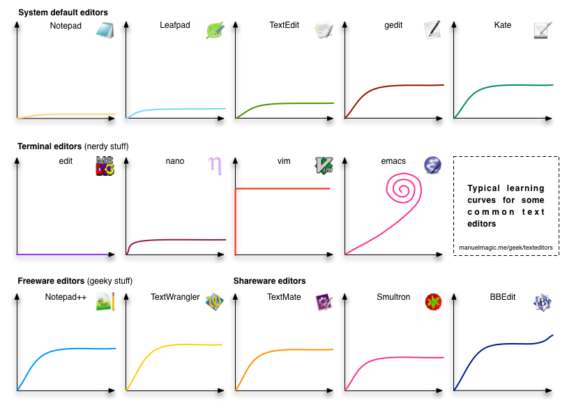

# 1.什么是vim

## 1.历史，和来历
* vim的全称是vi improved，前身是vi，vi是一款有40多年历史的编辑器,比我们大部分人年纪都大，vim则在1991年的时候正式发布。大多数linux发行版上都预装了vim
，这使得vim成为非常流行的文本编辑器。
## 2.编辑器之战 
* 说到vim就不得不提到emacs，这两个编辑器，一个被称为编辑器之神， 一个被称为神之编辑器，emacs也是一个非常优秀的编辑器，同时拥有悠久的历史和众多的用户，
在开源社区，两个编辑器的用户互相蔑视，坚信自己的编辑器才是最好的。emacs的作者甚至成立了emacs教会，称vi是魔鬼的编辑器。

# 2.为什么要使用vim

## 1.专注开发
* 就我个人的感受而言，我认为在编码时，不停的使用鼠标是非常不好的习惯，使用鼠标，需要像玩射击游戏一样用非常小的指针去定位你要操作的地方，然后小心翼翼的放慢速度，然后
进行选择或者复制粘贴的工作。经常能看到一个非常厉害的程序员正在进行非常流畅的编码，他沉浸在其中，可以听到他敲击键盘的声音，是连续且由节奏的，突然，这个声音消失了，他停止
了下来，因为他想重命名一个之前定义的变量名，于是不得不把手移到鼠标上，滑动滚轮定位到变量的大概位置，然后再切换到细瞄准模式，也就是移动鼠标，瞄准他要修改的的变量的最后一个字符，
再单击一下，这样他才能开始重命名，他必须减慢瞄准的速度，这样才能准确瞄准，对于不太擅长瞄准的程序员来说，可能需要更慢的速度。这种操作方式效率低下，使得程序员不得不分心，手离开键盘。

* 现在，我们将vim送给这个程序员，于是他可以更专注的编码，为什么？因为vim最初的设计就是面向命令行的编辑器，压根就没有考虑到可以用鼠标操作，他再也不用小心翼翼的操作鼠标,
所以他可以继续流畅的编码，并且双手不用再离开键盘，办公室将会再次充满他连续且有节奏的敲击键盘声。

## 2.提高效率
* 天下武功，唯快不破，就我个人而言，作为一名一线业务逻辑程序员，目前的大部分工作时间我不用设计精妙的算法和抽象一个复杂的框架，这不是我的核心竞争力，我的核心竞争力是
在尽量短的时间内产生大量的逻辑代码，完成很具体的业务需求。使用vim，我可以很大程度的提高我在编码时的速度，**使我在低端程序员里站稳脚跟**。

# 3.vim入门
## 1.为什么难以入门
* 几个常用编辑器学习曲线比较 
1. 

* 也许每个首次使用vim的同学都面对过无法退出vim的问题
1. 
 
vim具有非常独特，甚至看起来有一些反直觉的编辑哲学（熟悉之后发现并不是），这导致vim的劝退点非常多。 
想要流畅的使用vim，一般情况下还是需要一定量的练习和学习,然而，高成本高收益，熟练使用vim以后，你真的会离不开它。

## 2.理解vim的模式
* 首先简要的说一下vim的模式，在我们平时使用的编辑器中，小到记事本，大到visual studio都使用"随时可以输入"这个逻辑，也就是你在一直处于输入状态，而其他的操作，比如
复制粘贴等，都可以在输入的状态下完成,也就是输入的附属功能。这就使我们在使用任何编辑器时都有这样一个直觉:我随时是可以输入的。然而vim的输入方式是违反这个直觉的，这也就是在初期，很多人
觉得vim非常难用的原因。

* 在vim中，输入功能是一个非常纯粹的功能，也是最简单的一个功能，我们不用花太多的笔墨，它是一个模式，在这个模式里，你除了输入和停止输入，其他什么也不能做。而其他的编辑，你需要在其他的模式里面完成。

* 命令模式: 在vim中，我们除了输入外基本都处于命令模式，在这个模式里，我们可以进入输入模式进行输入，也可以进入visual模式，进行选择，或者进入底线命令模式输入指令。除了进入其他模式
命令模式里剩下的功能就是我们使用 vim language(也就是vim的命令)与vim进行互动，完成编辑功能。

* visual模式: 这个模是用来进行文本的选择的模式，比如选中段落，选中块，然后在选中的内容上应用命令。

* 底线命令模式: 这里的底线是指在vim底部的一个命令输入框，从命令模式输入冒号之后可以进入这个模式，在这个模式里我们可以输入命令，或者运行脚本。

* 以上提到的模式，均由命令模式进入，返回时均返回到命令模式。

## 3.理解vim的语言
* vim的命令看起来非常多，并且非常枯燥，很难记忆，实则不然。很多命令都可以用“vim语言来记忆” 比如w表示word，前进一个word，b表示back，g表示go等等。实在记不住的还可以使用
vim鼠标垫来帮助记忆(鼠标垫图片)

* 基础导航: vim的导航功能很强大，如果加上命令组合会更厉害，我们可以先了解基础的几种。
    1. 在vim中基本不会用到键盘上的导航键，vim通过hjkl四个键进行导航。h表示左进一个字符，j表示下进一个字符，k表示上进一个字符，l表示又进一个字符，为什么这样安排呢?
    这是因为这样可以使双手不离开键盘的输入区域，提高输入速度，同时j键上会有一个突起，方便右手的盲定位。 
    2. 除了上下左右之外，vim还使用w键表示前进一个word，也就是一个单词，使用b键表示后退一个word。输入e则表示调到词尾的那一个字符(w会超过词尾)
    3. 如果想要跳到行结束，我们可以直接输入$符号，也就是按shift+4。如果想要跳到段落开头，我们可以直接输入0。
    4. 有的时候我们想要跳到一个括号结束的地方，或者从一个括号结束的地方回到括号开始的地方，这是后就可以输入将光标导航到括号上，再输入百分号即可。
    5. 想要跳到文本最底行的话，输入大写的G也就是再键盘上输入shift+g，跳到最顶行的话，输入gg。
    6. 很多时候我们想要把正在编辑的文本放到我们的视野中来，这个时候我们只需要输入zz即可。

* visual模式：通过输入v命令进入此模式，这个模式还可以进一步分为block visual 和 line visual模式，也就是按块选中或者按行选中，选中之后可以使用命令多选中的部分进行编辑，比如复制
删除等。

* 基础命令:
    1. insert， 在键盘上输入i ，将会进入编辑模式，将从光标的前面进入。如果输入大写的I，会在行首插入。
    2. append，在键盘上输入a，将会进入编辑模式，会从光标的后面进入。如果输入大写的A，会在行末插入。
    3. 复制，在vim中复制有点特别，按照直觉，可能大家会觉得复制应该使copy那么vim语言中对应的命令应该使c。其实不是这样，在vim中复制命令是y，代表yank，而c有一个更重要的用途。
    4. 粘贴，粘贴的命令是p，很直觉。
    5. 更改，更改就是c的用途，代表change，不过c键需要等待后续命令，在后面命令组合的时候再细说。
    6. 删除，删除一个字符我们可以用x，比较高级的删除我们可以使用d命令来组合其他命令。
    7. undo，再vim中，撤销的命令是u，这符合直觉，但是redo的命令是ctrl+r快捷键，这是因为r命令用来给replace用了。
    8. replace，快捷键为r，顾名思义，就是替换当前选中的内容,小写r是替换一个字符，大写的R是进入替换模式，逐字替换。

* 底线命令：

    1. 通常在底线命令中我们是输入较为复杂的命令，比如导航到具体的某个行，只需要在底线命令中直接输入行号再回车就可以导航过去。
    2. 设置vim的属性，比如设置插件开关，设置行号显示，或者执行脚本等，这属于高级范畴，不做探讨。
    3. 保存，w表示保存，其实是将当前的编辑buffer写入文件。
    4. 退出，困扰无数人的vim退出，其实只要输入q命令就行了，强制退出的话需要语气强硬一些，所以再q后面加一个感叹号，表示强制退出，不保存。

* 怎么样，其实vim的命令并没有想象中那么复杂，通过上面这些命令，我们就可以进行编辑了。但是光是可以编辑是不够的，下面我们看一下vim的命令组合功能，这个功能让vim的命令变得强大
许多倍。

## 4.组合vim的语言

* vim通过命令组合，将各个命令的效果叠加，通过一连串的简单命令可以组合出一个非常复杂的命令，从而完成复杂的编辑工作。下面来看例子。
    1. repeat，通过数字和命令的组合，可以重复一个命令指定的次数。比如需要向上十行，我们不需要按k键十次，而是直接输入10后面跟上k这个命令，也是在键盘上依次按下10k三个键就会使
光标上移十行。不仅导航，删除，或者粘贴，或者w,b等等命令都可以与数字组合。这一个功能可能就节省了数十倍的导航时间。

    2. 组合作用域: 比如前面说到的，d键与w组合时，表示删除一个单词，d与$组合表示删除到行尾，d与t后加上一个字符，表示delete till char 删除到char这个字符,比如dta
表示删除到当前光标一直到下一个a的所有字符 。d与i后加括号或者引号表示删除被括号或者引号围起来的内容，这是非常有用的一个组合，更改括号或者引号里面的东西太普遍了。同理对于其他的命令也可与组合作用域。

    3. 上次命令：键盘上符号，也就是右尖括号，表示重复上一个命令。

* 上面就是使用vim的基本知识，怎么样，其实也没有多少东西是吧，掌握了这些以后，只要稍加练习，很快就能形成vim语言的肌肉记忆，到时候不是按键执行命令，而是在心里默念神秘代码，
d to a， c word等等。

# 4.如何配置一个vim-like的ide

* vim非常强大，通过插件配合，完全可以作为IDE使用，但是，这样的配置使非常复杂的，并且相比专业的IDE，vim还没有那么多方便的功能。那我们怎么把vim
跟平时使用的IDE结合呢，不难想到：使用IDE的vim插件。 

## 1.rider
* rider是我平时使用的IDE，在rider中，有官方提供的idea-vim插件提供vim的模拟，当然jetBrain公司的其他IDE中也有ideal-vim插件。在rider中使用vim插件还可以自定义一些快捷键，补充vim
没有的功能，比如我ctrl+tab键切换编辑的文件，而不适用vim中ctrl+w的跳转。并且idea-vim支持部分vimrc配置。关于vimrc的内容，我们在高级内容里再说。
## 2.其他IDE
* 在visual studio中也有vim的插件，我试用了一下感觉效果还不错，但是速度和命令似乎没有idea-vim好。
* VSCode中下载量最高的vim插件，速度还可以，但是对vimrc的支持非常有限。

# 5.高级技巧
## 1.vimrc配置

* vimrc是什么，在linux或者unix系统中，vimrc的存放路径是 /home/username/.vimrc ，在vim启动时，vim会扫描vimrc文件并且执行其中的命令，也就是可以作为配置来使用。
建议搭建把自己的vimrc放到github，随时更新，有需要时直接下载来就用。

* 常见的vimrc 命令：这里说的命令同时也可以在底线命令模式里面逐条执行。
    1. set number 这是最常见的命令，就是打开左边的代码行数字。
    2. set relativenumber 打开相对行模式，非常好用
    3. set incsearch 打开增量搜索 使用这个可以使用增量搜索魔兽
    4. set ignorecase 搜索时忽略case 与smartcase连用
    5. set smartcase

其他还有很多命令和插件，大家可以为每个开发环境设置一个vimrc，随心切换。

## 2.宏

* 宏是vim又一个非常强大的功能，在了解到了vim的命令和组合模式后，其实vim的编辑逻辑可以简化为：使用序列的命令来组合文本。有了这个概念，宏就很好理解了，宏记录我们每一个
命令，然后依次播放他们，这样就可以组合出非常复杂的操作。
    1. 录制宏：录制宏需要在命令模式按下q键然后选择一个寄存器（就是一个字母表示宏的名字）,比如按下qq就表示开始宏录制，并且在录制结束把录制结果放入q寄存器。开始录制后，vim就
把我们的所有操作记录下来，当我们再次在命令模式中按下q时将结束宏录制。
    2. 使用宏：我们输入@+寄存器名就可以播放刚刚录制的宏。

## 3.脚本

* vim支持vim-script进行扩展和编程，我们可以再vimrc中定义我们自己的函数，然后在底线命令中使用，同时vim内置了许多功能强大的函数，不过这是另外一个很大的话题，这里就不深入了。
